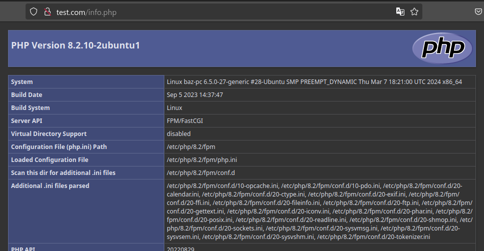
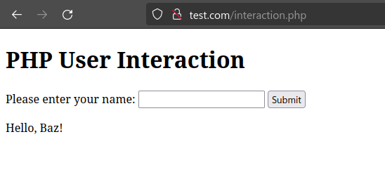

# PHP - Install, Setup, Configure

## Install PHP

```sh
sudo apt install php php-fpm
```

## Configure PHP-FPM

Open the php-fpm configuration file

```sh
baz@baz-pc:/$ code /etc/php/8.2/fpm/php.ini
baz@baz-pc:/$
```

"The `cgi.fix_pathinfo` setting in the PHP-FPM configuration file is related to security and how PHP-FPM handles file execution.

When `cgi.fix_pathinfo` is set to 1 (the default value), PHP-FPM will attempt to execute a file with a similar name if the requested file doesn't exist. For example, if a request is made for `file.php` and it doesn't exist, PHP-FPM will try to execute `file.php-something` if it finds a file with that name.

This behavior can be exploited by attackers to execute arbitrary code if they can upload files with crafted names. By setting `cgi.fix_pathinfo` to 0, PHP-FPM will only execute the exact file that was requested and won't attempt to find and execute similarly named files."

Adjust the `cgi.fix_pathinfo` setting to 0 (from default 1)

```ini
; cgi.fix_pathinfo provides *real* PATH_INFO/PATH_TRANSLATED support for CGI.  PHP's
; previous behaviour was to set PATH_TRANSLATED to SCRIPT_FILENAME, and to not grok
; what PATH_INFO is.  For more information on PATH_INFO, see the cgi specs.  Setting
; this to 1 will cause PHP CGI to fix its paths to conform to the spec.  A setting
; of zero causes PHP to behave as before.  Default is 1.  You should fix your scripts
; to use SCRIPT_FILENAME rather than PATH_TRANSLATED.
; https://php.net/cgi.fix-pathinfo
cgi.fix_pathinfo=0
```

## Connfigure Nginx to use PHP-FPM

Open the nginx configuration file in VSCode

```sh
baz@baz-pc:/$ code /etc/nginx/sites-available/test.com
```

Add a location block to handle PHP files

```nginx
server {
    listen 80;
    server_name test.com;
    root /var/www/test.com/html;
    index index.html;

    location / {
        try_files $uri $uri/ =404;
    }

    location ~ \.php$ {
        include snippets/fastcgi-php.conf;
        fastcgi_pass unix:var/run/php/php8.2-fpm.sock;
    }
}
```

This location block is used to handle PHP files in Nginx and pass them to PHP-FPM for execution.

1. `location ~ \.php$ { ... }`:

   - This line defines a location block that matches any request ending with `.php`.
   - The `~` symbol denotes a case-sensitive regular expression match.
   - The `\.php$` regular expression matches any string that ends with `.php`. The backslash (`\`) is used to escape the dot (`.`) character, which has a special meaning in regular expressions.

2. `include snippets/fastcgi-php.conf;`:

   - This line includes the contents of the `fastcgi-php.conf` file located in the `snippets` directory.
   - The `fastcgi-php.conf` file typically contains common FastCGI configuration directives for PHP, such as setting the `fastcgi_split_path_info` and `fastcgi_param` directives.
   - By including this file, you can keep the location block clean and reuse the common FastCGI configuration across multiple location blocks.

3. `fastcgi_pass unix:/var/run/php/php8.2-fpm.sock;`:
   - This line specifies the FastCGI server to which Nginx should pass the PHP requests.
   - In this case, it is using a Unix domain socket file (`php8.2-fpm.sock`) located at `/var/run/php/` to communicate with the PHP-FPM process.
   - The `unix:` prefix indicates that it is a Unix domain socket file path.
   - The socket file path may vary depending on your PHP-FPM version and configuration. Make sure to use the correct socket file path for your setup.

When a request comes in for a PHP file (e.g., `http://test.com/index.php`), Nginx will match this location block based on the `.php` extension. It will then include the common FastCGI configuration from the `fastcgi-php.conf` file and pass the request to the PHP-FPM process using the specified Unix domain socket file.

PHP-FPM will then execute the PHP script and return the result back to Nginx, which will send the response to the client's browser.

By using this location block, you are essentially telling Nginx to handle PHP files differently than other static files. Instead of serving them directly, Nginx passes PHP files to PHP-FPM for execution, allowing you to run PHP scripts as part of your web application.

## Create a new PHP file

Create a new php file in the website's root directory

```sh
baz@baz-pc:/$ sudo touch /var/www/test.com/html/info.php
```

Open the php file in VSCode

```sh
baz@baz-pc:/$ code /var/www/test.com/html/info.php
```

## Restart Nginx and PHP-FPM

```sh
baz@baz-pc:/$ sudo systemctl restart nginx
baz@baz-pc:/$ sudo systemctl restart php8.2-fpm
baz@baz-pc:/$

```

## Visit the PHP page

Visit [http://test.com/info.php](http://test.com/info.php)



## Add a PHP page to test user interaction

Create a new `interaction.php` file

```sh
baz@baz-pc:/$ sudo touch /var/www/test.com/html/interaction.php
```

Open it in VSCode

```sh
baz@baz-pc:/$ code /var/www/test.com/html/interaction.php
```

Add the following

```php
<!DOCTYPE html>
<html lang="en">
<head>
  <meta charset="UTF-8">
  <meta name="viewport" content="width=device-width, initial-scale=1.0">
  <title>PHP User Interaction</title>
</head>
<body>
    <h1>PHP User Interaction</h1>
    <form method="post" action="<?php echo htmlspecialchars($_SERVER["PHP_SELF"]); ?>">
        <label for="name">Please enter your name:</label>
        <input type="text" id="name" name="name" required>
        <button type="submit">Submit</button>
    </form>
    <?php
    if ($_SERVER["REQUEST_METHOD"] == "POST") {
        $name = $_POST["name"];
        echo "<p>Hello, " . htmlspecialchars($name) . "!</p>";
    }
    ?>
</body>
</html>
```

Visit [http://test.com/interaction.php](http://test.com/interaction.php)


